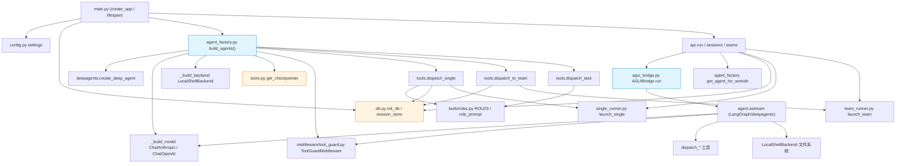
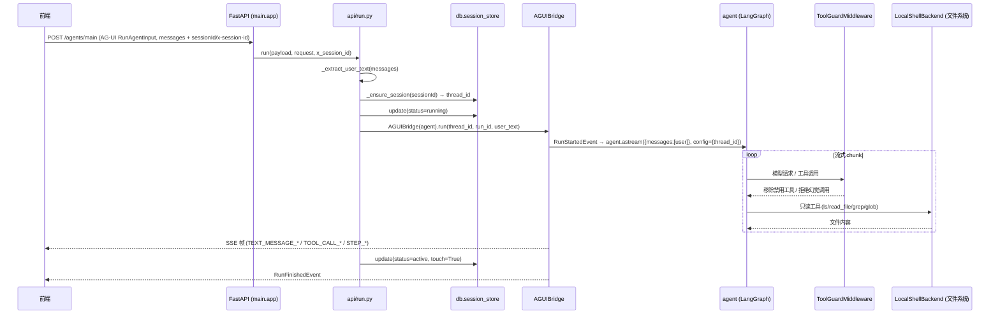

# openmanus 架构文档（ARCHITECTURE）

> 本文档面向新成员，系统性地介绍 **openmanus** 后端项目的整体架构、技术栈、模块职责、数据流与设计决策。
> 后端代码位于 [`backend/src/openmanus`](./backend/src/openmanus)，是一个基于 **FastAPI + LangGraph + deepagents** 构建的智能体（Agent）服务，对外通过 **AG-UI 协议（SSE）** 与 CopilotKit 前端交互。

---

## 目录

- [1. 项目概述（Project Overview）](#1-项目概述project-overview)
- [2. 技术栈（Tech Stack）](#2-技术栈tech-stack)
- [3. 目录结构（Directory Structure）](#3-目录结构directory-structure)
- [4. 核心模块说明（Core Modules）](#4-核心模块说明core-modules)
- [5. 系统架构与数据流（Architecture & Data Flow）](#5-系统架构与数据流architecture--data-flow)
- [6. 数据模型（Data Models）](#6-数据模型data-models)
- [7. API 设计概览（API Overview）](#7-api-设计概览api-overview)
- [8. 关键设计决策与约定（Key Design Decisions）](#8-关键设计决策与约定key-design-decisions)
- [9. 快速上手（Quick Start）](#9-快速上手quick-start)

---

## 1. 项目概述（Project Overview）

**openmanus** 是一个 opencode 风格的 AI 编码 Agent 后端（`pyproject.toml`：`name = "openmanus"`，`version = "0.1.0"`，描述 *"opencode clone backend: deepagents + AG-UI endpoint for CopilotKit"*）。

### 定位

基于 LangChain 生态的 `deepagents` 库构建智能体，能够对**真实本地文件系统**进行读 / 写 / 执行操作，并对外暴露标准 **AG-UI 协议** 的 SSE（Server-Sent Events）接口，供前端（vite + react + mobx，自渲染 AG-UI 流）消费。

### 一句话架构

> `FastAPI 应用 → AG-UI SSE 端点 → AGUIBridge 把 LangGraph 流转成 AG-UI 事件 → 驱动 deepagents 智能体图（默认路由 agent + TeamLeader 协调 agent + 子 agent 分发机制）→ 操作 LocalShellBackend（真实文件系统）+ SQLite checkpointer 持久化历史`

### 通信方式

前端通过 `POST /agents/main`（AG-UI SSE）与后端通信，vite dev proxy 将请求转发到后端 `:8999`。

### 三层 Agent 架构

| 层级 | Agent | 职责                                                         | 权限                                       |
| --- | --- |------------------------------------------------------------|------------------------------------------|
| ① 入口层 | **默认路由 agent** | 纯路由 + 只读查询；写/执行工具被硬剥除                                      | 只读（`ls` / `read_file` / `grep` / `glob`） |
| ② 单专家层 | **`dispatch_single`**（异步后台） | 委派给 `Researcher` / `Coder` 子 agent                         | 按角色 allow-list                           |
| ③ 团队层 | **`dispatch_to_team`**（TeamLeader 协调） | TeamLeader 内部用同步 `dispatch_task` 调度 `Researcher` / `Coder` | TeamLeader 保留文件工具                        |

### 核心价值

1. 把 LangGraph 的流式输出桥接为标准 **AG-UI SSE** 事件，供自渲染前端消费；
2. 实现**三层 Agent 架构**（默认路由 → 单专家 / 团队），通过 `dispatch_*` 工具 + `ToolGuardMiddleware` 双层护栏实现职责隔离；
3. **双层持久化**（checkpointer 存消息内容 + sessions.db 存会话元数据 / 协作图）；
4. 对真实本地文件系统操作（`LocalShellBackend`，`virtual_mode=False`）。

---

## 2. 技术栈（Tech Stack）

来源：`backend/pyproject.toml`。

| 类别 | 依赖 | 版本要求 | 用途 |
| --- | --- | --- | --- |
| 语言 | Python | `>=3.12`（`requires-python`） | `.python-version` 固定版本 |
| 构建 / 包管理 | `uv`（`uv_build`） | `>=0.11.24,<0.12.0` | 锁文件 `uv.lock`；`[tool.uv] package=true`，`module-name = "openmanus"` |
| Web 框架 | `fastapi` | `>=0.115` | 异步 HTTP 服务 |
| ASGI 服务器 | `uvicorn[standard]` | `>=0.34` | 启动：`uv run uvicorn openmanus.main:app --reload --port 8999` |
| 配置 | `pydantic-settings` | `>=2.5` | `.env` 驱动 `BaseSettings` |
| 环境变量 | `python-dotenv` | `>=1.0` | `.env` 加载 |
| Agent 核心 | `deepagents` | `>=0.1` | `create_deep_agent` 编排智能体 |
| LLM 框架 | `langchain` | `>=0.3` | LangChain 基础 |
| LLM 提供商 | `langchain-openai` | `>=0.2` | OpenAI 兼容路径 |
| | `langchain-anthropic` | **未在 pyproject 声明 ⚠️** | `agent_factory.py` 直接 `from langchain_anthropic import ChatAnthropic`；当前由传递依赖引入 |
| Agent 编排 | `langgraph` | `>=0.6` | 状态图 + checkpointer |
| 持久化 / checkpoint | `langgraph-checkpoint-sqlite` | `>=2.0` | 默认 SQLite saver |
| | `langgraph-checkpoint-postgres` | **运行时动态 import** | 切 Postgres 时用，非声明依赖 |
| 协议 | `ag-ui-protocol` | `>=0.1` | AG-UI 事件类型 |
| 数据库驱动 | `aiosqlite` | `>=0.22.1` | 会话表原生 SQL |

### 关键技术点

- **无独立 ORM**：会话表用**原生 SQL + aiosqlite**，无 SQLAlchemy / Tortoise 等。
- **无消息队列中间件**：团队 / 子 agent 的实时分发用**进程内 `asyncio.Queue`**（MVP 设计，进程重启会丢失运行中的任务）。
- **默认数据库**：SQLite（`data/checkpoints.db` + `data/sessions.db`），可切换 Postgres。
- **默认模型**：`GLM-5.2`，走 Anthropic 协议（BigModel：`https://open.bigmodel.cn/api/anthropic`）；可切 OpenAI 兼容。

---

## 3. 目录结构（Directory Structure）

```
D:/deepagents-opencode/
├── ARCHITECTURE.md                    # 本文档（架构说明）
├── README.md                          # 项目总说明（deepmanus）
├── restart.bat                        # Windows 启动脚本（杀旧进程 + 起 backend/frontend）
├── frontend/                          # 前端（vite + react + mobx，自渲染 AG-UI 流）
└── backend/                           # ★ 后端（即 src-layout 包 openmanus）
    ├── .env                           # 运行时环境变量（含真实密钥 ⚠️）
    ├── .env.example                   # 环境变量模板
    ├── .gitignore
    ├── .python-version                # Python 版本固定
    ├── pyproject.toml                 # ★ 依赖与构建配置（uv + uv_build）
    ├── uv.lock                        # uv 依赖锁文件
    ├── README.md                      # 后端说明（当前为空）
    ├── data/                          # 运行时 SQLite（自动生成）
    │   ├── checkpoints.db             # LangGraph 消息内容层（checkpointer 管理）
    │   ├── checkpoints.db-shm / -wal  # SQLite WAL 辅助文件
    │   └── sessions.db                # 会话元数据 + 协作图层（自管）
    ├── tests/
    │   └── test_bridge.py             # AGUIBridge 离线冒烟测试（FakeAgent，非标准 pytest）
    ├── src/
    │   └── openmanus/                  # ★ 唯一后端包（src-layout）
    │       ├── __init__.py            # 包入口，仅 __version__ = "0.1.0"
    │       ├── py.typed               # PEP 561 类型标记（空文件）
    │       ├── main.py                # ★ FastAPI 应用入口（create_app / lifespan）
    │       ├── config.py              # ★ 配置（pydantic-settings Settings 单例）
    │       ├── store.py               # ★ LangGraph checkpointer 工厂（SQLite/Postgres）
    │       ├── db.py                  # ★ SessionStore（会话元数据 + 协作图，原生 SQL）
    │       ├── agent_factory.py       # ★ 构建默认 agent + TeamLeader agent（per-workdir 缓存）
    │       ├── agui_bridge.py         # ★ AGUIBridge：LangGraph 流 → AG-UI 事件（核心心脏）
    │       ├── single_runner.py       # ★ 单子-agent 后台运行器（SSE 队列）
    │       ├── team_runner.py         # ★ TeamLeader 后台运行器（SSE 队列 + 群聊）
    │       ├── api/                   # HTTP 路由层
    │       │   ├── __init__.py        # 导出 run / sessions / teams 三个 router
    │       │   ├── run.py             # ★ AG-UI run 端点 POST /agents/main(/) + /health
    │       │   ├── sessions.py        # ★ 会话 CRUD + 历史回放 + 子 agent 流 + workdir 校验
    │       │   └── teams.py           # ★ 团队 SSE 流 + 群聊历史 + 投递消息
    │       ├── middleware/            # Agent 中间件
    │       │   ├── __init__.py        # 仅 docstring
    │       │   └── tool_guard.py      # ★ ToolGuardMiddleware：双层工具禁用护栏
    │       └── tools/                 # 自定义 LangChain 工具
    │           ├── __init__.py        # 导出三个 dispatch 工具工厂
    │           ├── dispatch_single.py # ★ dispatch_single：默认 agent → 单个专家（异步）
    │           ├── dispatch_to_team.py# ★ dispatch_to_team：默认 agent → 后台团队（异步）
    │           ├── dispatch_task.py   # ★ dispatch_task：TeamLeader → 子 agent（同步）
    │           └── roles.py           # ★ ROLES 字典：Researcher / Coder 角色与允许的工具
    ├── agents/                        # （dispatch_task 创建的子 agent 工作目录，运行时生成）
    ├── workspace/, 01_code/           # 其他工作目录（运行时数据）
    └── dfs_algorithm.py, bfs_algorithm.py, Z  # 算法示例（DFS/BFS 实现，agent 运行产物，非核心代码）
```

### 各目录职责速览

| 目录 / 文件 | 职责 |
| --- | --- |
| `src/openmanus/` | 唯一后端 Python 包，承载所有核心逻辑 |
| `api/` | FastAPI 路由层（AG-UI run、会话 CRUD、团队流） |
| `middleware/` | Agent 中间件（工具访问护栏） |
| `tools/` | 自定义 LangChain 工具（三种委派工具 + 角色定义） |
| `data/` | 运行时 SQLite 数据库文件（双层持久化） |
| `tests/` | 离线测试（AGUIBridge 冒烟测试） |

---

## 4. 核心模块说明（Core Modules）

### 4.1 应用入口 — `main.py`

文件路径：`src/openmanus/main.py`

| 要点 | 说明 |
| --- | --- |
| **Windows UTF-8 修复** | 文件顶部（import 前）：设置 `PYTHONIOENCODING=utf-8`、`PYTHONUTF8=1`，并 `sys.stdout/stderr.reconfigure(encoding="utf-8")`，规避中文 Windows cp936/GBK 编码导致 `LocalShellBackend` 子进程乱码 |
| **`create_app() -> FastAPI`** | 构建 `FastAPI(title="openmanus", version="0.1.0", lifespan=lifespan)` |
| **CORS** | `CORSMiddleware(allow_origins=settings.cors_origin_list, allow_credentials=True, allow_methods=["*"], allow_headers=["*"])` |
| **模块级 `app`** | `app = create_app()`，即 ASGI app 对象 |

**路由挂载**：

| Router | 挂载前缀 | 说明 |
| --- | --- | --- |
| `run.router` | `/agents/main` | 核心 AG-UI 端点 |
| `run.router` | `/agents` | 便捷别名 |
| `sessions.router` | `/sessions`（自带） | 会话 CRUD |
| `teams.router` | `/teams`（自带） | 团队流 |
| `workdir_router` | （无前缀） | `POST /workdir/validate` |

**`lifespan(app)`**（async context manager，启动钩子）：
1. `await init_db()` —— 建表；
2. `await session_store.ensure_default()` —— 种子默认入口会话（id="default"，单例）；
3. `app.state.agent, app.state.TeamLeader = await build_agents()` —— 预构建默认 agent + TeamLeader；
4. 日志输出 model / base_url / workdir / database_url。

---

### 4.2 配置 — `config.py`

文件路径：`src/openmanus/config.py`

`Settings(BaseSettings)`，`model_config = SettingsConfigDict(env_file=".env", env_file_encoding="utf-8", extra="ignore")`。

| 字段 | 类型 | 默认值 | 说明 |
| --- | --- | --- | --- |
| `model_provider` | `str` | `"anthropic"` | 选 `ChatAnthropic` / `ChatOpenAI` |
| `model` | `str` | `"GLM-5.2"` | 默认模型名 |
| `anthropic_api_key` | `str` | `""` | Anthropic 协议密钥 |
| `anthropic_base_url` | `str` | `"https://open.bigmodel.cn/api/anthropic"` | BigModel Anthropic 兼容端点 |
| `openai_api_key` | `str` | `""` | OpenAI 密钥 |
| `openai_base_url` | `str` | `"https://api.openai.com/v1"` | OpenAI 端点 |
| `ssl_verify` | `bool` | `True` | 是否校验 TLS 证书（自签名 / 内网可置 False，两种 provider 均生效） |
| `workdir` | `str` | `str(Path.cwd())` | agent 工作目录 |
| `database_url` | `str` | `"sqlite:///./data/checkpoints.db"` | checkpointer 数据库 |
| `host` | `str` | `"127.0.0.1"` | 监听地址 |
| `port` | `int` | `8999` | 监听端口 |
| `cors_origins` | `str` | `"*"` | CORS 来源 |
| `system_prompt` | `str` | 见下 | 基础系统提示 |

- 默认 `system_prompt`：*"You are manus, an AI coding agent operating in the user's project directory. Use the file system tools to read, edit, and run code. Be concise. Explain what you are about to do, then do it."*
- **属性 `cors_origin_list`**：`cors_origins == "*"` 时返回 `["*"]`，否则逗号分隔 + strip 的列表。
- **模块级单例**：`settings = Settings()`。

---

### 4.3 持久化（双层分离）— `store.py` + `db.py`

#### 4.3.1 LangGraph checkpointer（消息内容层）— `store.py`

文件路径：`src/openmanus/store.py`

- **`_is_postgres(url)`**：判断 URL scheme 是否 `postgres` / `postgresql`。
- **`_sqlite_path(url)`**：规范化 sqlite URL 为文件系统路径（剥前缀 + `expanduser` + 确保父目录存在）。
- **`get_checkpointer() -> BaseCheckpointSaver`**（异步工厂）：按 `settings.database_url` 协议选择 saver：
  - `postgres` → `AsyncPostgresSaver.from_conn_string(...)`（动态 import，连接串 `postgresql+psycopg://` → `postgresql://` 转换），`await saver.setup()`；
  - 默认 SQLite → `aiosqlite.connect(_sqlite_path(url))` → `AsyncSqliteSaver(conn)`，`await saver.setup()`。
- **职责**：存储**消息内容**（按 `thread_id` 隔离历史）。
- **`from .config import settings`** 置于文件末尾以避免循环依赖。

#### 4.3.2 会话存储（元数据 + 协作图层）— `db.py`

文件路径：`src/openmanus/db.py`

- **`_db_path()`**：从 `settings.database_url` 推导 `sessions.db`（与 `checkpoints.db` 同目录，仅文件名改名）。
- **`init_db()`**：建表（启动时 `lifespan` 调一次）。
- **`_row_to_session(row)`**：把 row 转字典，并 `json.loads(metadata)`。

**`SessionStore` 类**（异步 CRUD）：

| 方法 | 功能 |
| --- | --- |
| `create(*, kind, name, title, model, workdir, metadata, session_id)` | 创建会话，id 默认 `f"sess-{uuid.uuid4().hex}"` |
| `get(session_id)` | 获取单个会话 |
| `ensure_default()` | 固定 id="default"，单例入口会话，幂等 |
| `ensure_exists(session_id, *, title)` | 确保 id 存在 |
| `list(kind=None)` | 按 `updated_at DESC` 排序 |
| `update(session_id, *, title, status, workdir, metadata, touch=True)` | 动态拼 SET 子句 |
| `delete(session_id)` | 删除会话 + 关联 `message_links` |
| `add_link(*, from_session_id, to_session_id, direction, content)` | 添加协作图边 |
| `get_graph(session_id)` | 返回 reactflow `{nodes, links}`（1-hop 图） |

- **模块级单例**：`session_store = SessionStore()`。
- 设计灵感：Claude Code（隔离 agent 上下文 + 可恢复 agentId）+ OpenClaw（per-agent workdir，可审计委派动作）。

> **双库分离**：`checkpoints.db`（消息内容，LangGraph 管理）vs `sessions.db`（会话元数据 + 协作图，自管）。

---

### 4.4 Agent 构建 — `agent_factory.py`

文件路径：`src/openmanus/agent_factory.py`

**常量**（双层硬约束的关键集合）：

| 常量 | 值 | 用途 |
| --- | --- | --- |
| `DEFAULT_EXCLUDED_TOOLS` | `frozenset({"write_file", "edit_file", "execute", "write_todos", "task"})` | 默认入口 agent 为纯路由 + 只读；`task`（deepagents 内建子 agent 分发）被剥除以防绕过自定义路由 |
| `TEAMLEADER_EXCLUDED_TOOLS` | `frozenset({"task"})` | TeamLeader 保留文件工具（可检查文件），仅 `task` 被禁；其唯一委派路径是 `dispatch_task` |

**系统 prompt**：

| Prompt | 定位                                                                                         |
| --- |--------------------------------------------------------------------------------------------|
| `DEFAULT_PROMPT`（f-string，拼接在 `settings.system_prompt` 之后） | **智能路由器**，三条决策路径：① 闲聊 / 只读查询直接作答；② 单专家任务 → `dispatch_single`；③ 复杂多步任务 → `dispatch_to_team` |
| `TEAMLEADER_PROMPT`（纯字面字符串） | **团队协调者**，用 `dispatch_task` 分发 Researcher / Coder 子 agent                                 |

**关键函数**：

| 函数 | 职责 |
| --- | --- |
| `_build_model() -> BaseChatModel` | 按 `model_provider` 分支：`anthropic` → `ChatAnthropic(model, api_key, base_url, streaming=True, max_tokens=8192)`；其他 → `ChatOpenAI(model, api_key, base_url, streaming=True)`（**未设 max_tokens**） |
| `_build_backend(workdir) -> LocalShellBackend` | `LocalShellBackend(root_dir=workdir, virtual_mode=False, inherit_env=True)` —— **真实文件系统操作** |
| `_build_default_agent(workdir, checkpointer, model)` | per-workdir 构建函数：① 建 TeamLeader（挂 `dispatch_task` + `ToolGuardMiddleware(TEAMLEADER_EXCLUDED_TOOLS)`，name=`"TeamLeader"`）；② 建默认 agent（挂 `dispatch_single` + `dispatch_to_team` + `ToolGuardMiddleware(DEFAULT_EXCLUDED_TOOLS)`，name=`"openmanus-default"`） |
| `build_agents()` | 启动预热，返回 `(default_agent, TeamLeader)`，针对 `settings.workdir` 构建 |
| `get_agent_for_workdir(workdir)` | 惰性构建并缓存（`_agent_cache: dict[str, tuple]`），首次调用时初始化 `_default_checkpointer` / `_default_model` |

> **设计要点**：默认 agent 的子 agent 跑在 **TeamLeader 的图**（含完整工具）上，因为默认 agent 自身的写/执行工具被剥除。

> ⚠️ **已知问题**：存在两个近似重复的构建函数（`_build_default_agent` 与 `build_agents`），`build_agents` 未复用前者（详见 §8）。

---

### 4.5 AG-UI 桥接 — `agui_bridge.py`（"心脏"）

文件路径：`src/openmanus/agui_bridge.py`

将 LangGraph 流块实时转换为 AG-UI SSE 事件的核心转换层。

| 组件 | 职责 |
| --- | --- |
| `_new_id()` | `uuid.uuid4().hex` |
| `_extract_text(content)` | 从流式消息 content 抽取文本，兼容 `str`（OpenAI）与 content-block list（Anthropic / GLM，`[{"text","type":"text"}]`） |
| `_StreamState` 类 | 跟踪当前打开的 assistant message id / `open_tool_calls: set` / `open_steps: set` |

**`AGUIBridge(agent)`**：

| 方法 | 职责 |
| --- | --- |
| `run(*, thread_id, run_id, user_text) -> AsyncIterator[str]` | 异步生成 SSE 帧（`data: {...}\n\n`）。流程：`RunStartedEvent` → `agent.astream(input_state, config={thread_id}, stream_mode=["messages","updates"], subgraphs=True, version="v2")` → 逐 chunk 经 `_handle_chunk` 转事件 → `finally`：`_close_open` → `RunFinishedEvent(Success)`；异常 → `RunErrorEvent` |
| `_handle_chunk(chunk, st)` | 纯同步，构造事件字符串：`ctype == "updates"` → `_handle_updates`（每个 node_name 发 `StepStarted` + `StepFinished`）；`ctype == "messages"` → `AIMessageChunk` → `_handle_ai_chunk`；`ToolMessage` → `_handle_tool_message` |
| `_handle_ai_chunk` | 处理 `tool_call_chunks`（首片段带 name → `ToolCallStart`；args → `ToolCallArgs`）+ 文本（`TextMessage{Start,Content}`） |
| `_handle_tool_message` | 发 `ToolCallResultEvent` + `ToolCallEndEvent`，并从 open set 中移除 |
| `_close_open` | 关闭仍打开的 assistant message（`TextMessageEnd`）与 tool calls（`ToolCallEnd`） |
| `_frame(event)` | `self._enc.encode(event)`，失败则降级为 `RAW` 事件 |

**LangGraph → AG-UI 事件映射**：

| LangGraph 信号 | AG-UI 事件 |
| --- | --- |
| run begin | `RUN_STARTED` |
| `AIMessageChunk` 文本 token | `TEXT_MESSAGE_{Start,Content,End}` |
| tool_call | `TOOL_CALL_{Start,Args,End}` |
| `ToolMessage` | `TOOL_CALL_RESULT` |
| node step | `STEP_{Started,Finished}` |
| exception | `RUN_ERROR` |
| end | `RUN_FINISHED` |

> **复用**：`single_runner` 与 `team_runner` 直接复用 `bridge._handle_chunk` 把 chunk 转帧推入队列（不走 `run()`）。

---

### 4.6 后台运行器（实时 SSE 分发）

#### 4.6.1 `single_runner.py`（单专家）

文件路径：`src/openmanus/single_runner.py`

| 组件 | 职责 |
| --- | --- |
| `SingleRegistry`（单例 `singles`） | `session_id -> asyncio.Queue[str]`。方法：`get_queue` / `has` / `discard` |
| `_DONE_SENTINEL()` | 返回 `{"type": "__single_done__"}` |
| `launch_single(*, agent, session_id, role, task_description, parent_session_id)` | `asyncio.create_task` 非阻塞启动 `_run_single_agent` |
| `_run_single_agent` | 在子 agent 自己的 thread（= `session_id`）上运行；前置 `role_prompt(role) + "\n\nTask:\n{task_description}"`；经 `AGUIBridge._handle_chunk` 把帧推入队列；成功 → `status="done"`；异常 → `status="error"` + `add_link(direction="result")`；`finally` 推哨兵 |

> 子 agent 跑在 **TeamLeader 的图**（含完整工具）上。

#### 4.6.2 `team_runner.py`（TeamLeader）

文件路径：`src/openmanus/team_runner.py`

| 组件 | 职责 |
| --- | --- |
| `_DONE` | `{"type": "__team_done__"}`（模块级常量） |
| `TeamRegistry`（单例 `teams`） | `team_id -> Queue` + `team_id -> asyncio.Task`。方法：`get_queue` / `is_running`（检查 task.done()）/ `register_task` / `team_ids` |
| `launch_team(*, team_agent, team_id, task_description, default_session_id)` | `asyncio.create_task` 非阻塞起 `_run_teamleader`，`teams.register_task` |
| `_run_teamleader` | ① 记录 `dispatch` link（default → team）；② 推 "📝 Team started" 群消息；③ `team_agent.astream(...)` 推帧入队；④ `aget_state` 取最后一条 AI 消息作为 final_text；⑤ 推 teamleader 最终群消息；⑥ `status="done"`；异常 → 推 "❌ Team failed"、`status="error"`；⑦ `finally` 推 `_DONE_SENTINEL()` |
| `_push_group_message(*, queue, team_id, speaker, text)` | 同时写 `message_links`（`[{speaker}] {text}` 约定，`direction="chat"`，from/to 都 = team_id）+ 推自定义 `GROUP_MESSAGE` SSE 帧（含 `messageId` / `speaker` / `content`，**非标准 AG-UI**） |

> ⚠️ **MVP 限制**：`TeamRegistry` 为内存态，进程重启会丢失运行中的团队。

---

### 4.7 API 路由层 — `api/`

详见 [§7. API 设计概览](#7-api-设计概览api-overview)。

---

### 4.8 中间件 — `middleware/tool_guard.py`

文件路径：`src/openmanus/middleware/tool_guard.py`

**解决的问题**：deepagents 自带的 `_ToolExclusionMiddleware` **只过滤模型请求**，模型仍可幻觉调用而被 `FilesystemMiddleware` 执行。

**`ToolGuardMiddleware(AgentMiddleware)`** —— 双层硬约束：

| 层 | 方法 | 行为 |
| --- | --- | --- |
| ① 模型请求层 | `wrap_model_call` / `awrap_model_call` | `request.override(tools=[...过滤掉 excluded...])`，从模型请求中移除禁用工具 |
| ② 工具执行层 | `wrap_tool_call` / `awrap_tool_call` | 若禁用工具被调用，返回**拒绝 `ToolMessage`**（*"delegate via dispatch_* instead"*）而非执行 |

构造：`ToolGuardMiddleware(excluded: frozenset[str])`。辅助函数 `_name(tool)` 从 tool（dict 或对象）取 name。

---

### 4.9 工具层 — `tools/`

#### 4.9.1 `roles.py` — 角色定义

文件路径：`src/openmanus/tools/roles.py`

`ROLES: dict[str, dict[str, Any]]`，两个角色：

| 角色           | 定位 | `allowed_tools` |
|--------------| --- | --- |
| `Researcher` | 只读调研，不可编辑/执行，返回简明发现 | `{"read_file", "list_directory", "ls", "glob", "grep"}` |
| `Coder`      | 实施变更，读/编辑/写/运行，返回简要总结 | `{"read_file", "write_file", "edit_file", "list_directory", "ls", "glob", "grep", "execute"}` |

- `role_prompt(role)`：返回 `ROLES[role]["prompt"]`，缺失则回退 `f"You are a {role} sub-agent. ..."`。
- ⚠️ `allowed_tools` 在 `dispatch_task` 的 `_filter_tools` 中**会被硬过滤**；`dispatch_single` 不做工具过滤（子 agent 跑在完整图的 thread 上）。

#### 4.9.2 委派工具（三种）

| 工具 | 工厂函数 | 文件 | 模式 | Input Schema |
| --- | --- | --- | --- | --- |
| `dispatch_single` | `make_dispatch_single_tool(*, agent_ref)` | `dispatch_single.py` | **异步（后台）** | `DispatchSingleInput{task_description, target_agent}` |
| `dispatch_to_team` | `make_dispatch_to_team_tool(*, team_agent_ref)` | `dispatch_to_team.py` | **异步（后台）** | `DispatchToTeamInput{task_description}` |
| `dispatch_task` | `make_dispatch_task_tool(*, agent_ref, parent_workdir)` | `dispatch_task.py` | **同步（阻塞 TeamLeader）** | `DispatchTaskInput{task_description, target_agent}` |

**`dispatch_single` 逻辑**：
1. 校验 `target_agent in ROLES`；
2. 从 `config.configurable.thread_id` 取 default_session_id；
3. 建 `kind="subagent"` 会话（metadata 含 role / allowed_tools / parent）；
4. `launch_single(...)`（后台）；
5. 记 `dispatch` link（default → child）；
6. 返回 *"Delegated to {role}, watch in Tasks"*。

**`dispatch_to_team` 逻辑**：
1. 建 `kind="team"` 会话（metadata 含 parent / `members=["TeamLeader","Researcher","Coder"]`）；
2. `launch_team(...)`（后台，非阻塞）；
3. 记 `dispatch` link；
4. 返回 *"Delegated to team {id}"*。

**`dispatch_task` 逻辑**（TeamLeader 用，同步）：
1. 取 parent_session_id、tool_call_id；
2. 校验 `target_agent in ROLES`；
3. 建 child workdir：`{parent_workdir}/agents/{target_agent}`（`mkdir -p`）；
4. 建 `kind="subagent"` 会话（workdir=child_workdir，metadata 含 role / allowed_tools / parent_tool_use_id）；
5. 记 `dispatch` link（parent → child）；
6. `_run_subagent`：新 thread（= child_id）跑 `agent.ainvoke`（prompt 前置 `[You are operating as: {role}]` + role prompt + task），取最后一条 AI 消息为 answer；
7. 记 `result` link（child → parent，content 截断 500 字符）；
8. 返回 answer。

- **`_filter_tools(all_tools, allowed)`**：保留 allow-list 内工具，空则回退全部（避免零工具运行）。
  > ⚠️ 实际 `_run_subagent` **未调用 `_filter_tools`**（见 §8），工具过滤仅在 prompt 层提示。

## 5. 系统架构与数据流（Architecture & Data Flow）

### 5.1 三层 Agent 架构总览

```
┌─────────────────────────────────────────────────────────────────────┐
│  用户（CopilotKit 前端，POST /agents/main，AG-UI SSE）                │
└──────────────────────────────┬──────────────────────────────────────┘
                               │
                               ▼
                  ┌────────────────────────┐
                  │  ① 默认路由 agent        │  ToolGuardMiddleware 剥除：
                  │  (openmanus-default)     │  write_file/edit_file/execute/task
                  │  入口路由 / 只读         │  保留：ls/read_file/grep/glob
                  └─────┬────────────┬──────┘
                        │            │
          dispatch_single            dispatch_to_team
           (异步后台)                  (异步后台)
                        │            │
                        ▼            ▼
        ┌───────────────────┐  ┌──────────────────────────┐
        │ ② 单专家            │  │ ③ TeamLeader agent        │
        │  Researcher/Coder  │  │  (openmanus-TeamLeader)    │
        │  (TeamLeader 图上)  │  │  团队协调者                │
        └───────────────────┘  │  dispatch_task (同步)      │
                               │       ├─ Researcher 子agent│
                               │       └─ Coder 子agent     │
                               └──────────────────────────┘
```

### 5.2 模块依赖关系（Mermaid）



**循环依赖规避**：`agent_factory` ↔ `tools` ↔ `runners` 之间存在潜在循环依赖，项目通过以下方式打破：
- **惰性 import**：例如 `run.py` 内部 `from ..agent_factory import get_agent_for_workdir` 延迟导入；`single_runner.py` 内 `from .tools.roles import role_prompt` 延迟导入。
- **间接引用**：通过 `agent_ref` dict 间接引用 agent，避免在模块顶层形成直接循环。
- **import 置于文件末尾**：`store.py` 末尾 `from .config import settings`。

### 5.3 请求处理流程（典型 HTTP/SSE 一轮）



### 5.4 三种委派路径的数据流

**路径 A — 默认 agent 直接作答（只读 / 闲聊）**：
前端 → `POST /agents/main` → 默认 agent（`ToolGuardMiddleware` 剥除 write/edit/execute）→ 只读工具 → SSE 回前端。

**路径 B — `dispatch_single`（单专家，异步后台）**：
前端 → 默认 agent 决策 → 调 `dispatch_single` → 建 subagent 会话 → `launch_single`（`asyncio.create_task`，立即返回 "Delegated"）→ 子 agent 在 TeamLeader 图的 thread 上跑 → 事件推入 `single_registry` 队列 → 前端通过 `GET /sessions/{id}/stream` 实时消费 → `[DONE]` 收尾。

**路径 C — `dispatch_to_team`（团队，TeamLeader 协调）**：
前端 → 默认 agent 决策 → 调 `dispatch_to_team` → 建 team 会话 → `launch_team`（非阻塞）→ TeamLeader 在自己 thread 上跑 → `dispatch_task`（同步）建 child 会话 → 子 agent ainvoke → 返回 answer → teamleader 复盘/再委派 → 最终群消息 → 事件推入 `team_registry` 队列 → 前端 `GET /teams/{id}/stream` 消费（标准 AG-UI 帧 + 自定义 `GROUP_MESSAGE`）→ `__team_done__` → `[DONE]`。

### 5.5 AG-UI SSE 通信机制

- **协议**：AG-UI（`ag-ui-protocol`），标准事件类型 `RUN_STARTED` / `TEXT_MESSAGE_*` / `TOOL_CALL_*` / `STEP_*` / `RUN_FINISHED` / `RUN_ERROR`。
- **传输**：`StreamingResponse`，`media_type="text/event-stream"`，响应头含 `X-Session-Id`、`Cache-Control: no-cache`、`X-Accel-Buffering: no`（禁用 nginx 缓冲）。
- **帧格式**：`data: {json}\n\n`，由 `EventEncoder`（`ag_ui.encoder`）编码；编码失败则降级为 `RAW` 事件。
- **自定义扩展**：团队群聊使用非标准 `GROUP_MESSAGE` 帧（含 `messageId` / `speaker` / `content` / `direction`）。
- **结束信号**：子 agent / 团队流以 `data: [DONE]\n\n` 收尾（消费端遇 `__single_done__` / `__team_done__` 哨兵时发出）。

---

## 6. 数据模型（Data Models）

### 6.1 双层持久化总览

| 层 | 数据库 | 管理者 | 存储内容 |
| --- | --- | --- | --- |
| 消息内容层 | `data/checkpoints.db` | LangGraph checkpointer（`store.py`） | 实际对话 token，按 `thread_id` 隔离 |
| 会话图层 | `data/sessions.db` | `SessionStore`（`db.py`，自管） | 会话元数据 + 协作有向边 |

> 两个 `.db` 文件位于同目录（`data/`），`sessions.db` 路径由 `_db_path()` 从 `database_url` 推导（仅改文件名）。

### 6.2 表 1：`sessions`（节点：每个 agent / 会话）

来源：`db.py` 的 `_SCHEMA`。**全部原生 SQL + aiosqlite，无 ORM。**

| 字段 | 类型 | 约束 / 默认 | 说明 |
| --- | --- | --- | --- |
| `id` | TEXT | PRIMARY KEY | 会话 id（如 `sess-{hex}`、固定 `default`、或前端传入） |
| `kind` | TEXT | NOT NULL DEFAULT `'root'` | ∈ `{root, team, subagent}` |
| `name` | TEXT | | 名称（如角色名 / "TeamLeader"） |
| `status` | TEXT | NOT NULL DEFAULT `'active'` | ∈ `{active, running, done, error}` |
| `title` | TEXT | | 标题 |
| `model` | TEXT | | 模型名 |
| `workdir` | TEXT | | 工作目录 |
| `metadata` | TEXT | NOT NULL DEFAULT `'{}'` | JSON 字符串（role / allowed_tools / parent / members / preview 等） |
| `created_at` | TEXT | DEFAULT `datetime('now')` | 创建时间 |
| `updated_at` | TEXT | DEFAULT `datetime('now')` | 更新时间 |

### 6.3 表 2：`message_links`（协作图的**有向边**）

| 字段 | 类型 | 约束 / 默认 | 说明 |
| --- | --- | --- | --- |
| `id` | INTEGER | PRIMARY KEY AUTOINCREMENT | |
| `from_session_id` | TEXT | NOT NULL REFERENCES sessions(id) | 边起点 |
| `to_session_id` | TEXT | NOT NULL REFERENCES sessions(id) | 边终点 |
| `direction` | TEXT | NOT NULL DEFAULT `'chat'` | ∈ `{dispatch, result, chat}` |
| `content` | TEXT | | 链接内容（dispatch=任务描述；result=子 agent 答案；chat=`[speaker] text`） |
| `created_at` | TEXT | DEFAULT `datetime('now')` | 创建时间 |

索引：`idx_links_from(from_session_id)`、`idx_links_to(to_session_id)`。

### 6.4 关系说明

- `sessions` 为**节点**，`message_links` 为**有向边**，构成 agent 协作图（前端用 reactflow 渲染）。
- `direction` 语义：

| direction | 方向 | 含义 |
| --- | --- | --- |
| `dispatch` | 父 → 子 | 委派任务 |
| `result` | 子 → 父 | 返回结果 |
| `chat` | 群聊（from/to 都 = team_id） | 群聊消息，content 格式 `[speaker] text` |

- `metadata` 常见键：`role`、`allowed_tools`、`parent`（父会话 id）、`members`（团队成员列表）、`parent_tool_use_id`、`preview`、`preview_speaker`。

> **注意**：消息**内容**（实际对话 token）不在此表，而由 LangGraph checkpointer 存于 `checkpoints.db`，按 `thread_id` 隔离。`sessions.db` 只存协作图骨架与元数据。

---

## 7. API 设计概览（API Overview）

### 7.1 完整路由前缀映射

| 挂载 | 前缀 | 来源 |
| --- | --- | --- |
| `run.router` | `/agents/main` | `main.py` |
| `run.router` | `/agents` | `main.py`（便捷别名） |
| `sessions.router` | `/sessions`（自带） | router 定义 |
| `teams.router` | `/teams`（自带） | router 定义 |
| `workdir_router` | （无） | `sessions.py` |

### 7.2 `/agents/main` — AG-UI Run 端点（`api/run.py`，核心）

| 方法 | 路径 | 功能 |
| --- | --- | --- |
| `POST` | `/`（即 `/agents/main/`、`/agents/`，同时注册 `/` 和 `""`） | **AG-UI run 端点**：接收 `RunAgentInput`，返回 `text/event-stream` AG-UI 事件流 |
| `GET` | `/health` | 健康检查 → `HealthResponse{status, model, workdir}` |

**`run` 端点处理流程**（`run(payload, request, x_session_id: Header)`）：
- `_extract_user_text(payload)`：从 AG-UI messages 抽取最后一条 user 文本（兼容 `str` 与 content-block list，回退 "Hello"）。
- `x-session-id` 头（`Header(alias="x-session-id")`）若存在则 `payload.setdefault("sessionId", ...)`。
- `_ensure_session(payload, user_text)`：解析 thread_id（优先级：body 的 `sessionId` / `session_id` / `thread_id` / `threadId`），有则 `get` 验证 / 无则 `create`；**保证同一会话多轮落在同一 checkpointer 线程**。
- `run_id`：`payload.get("run_id")` / `"runId"` 或 `f"run-{uuid.uuid4().hex}"`。
- agent 选择：`session.workdir` 存在 → `get_agent_for_workdir(workdir)`（per-workdir 缓存）；否则 `request.app.state.agent`。
- `stream()`：`session_store.update(status="running")` → `async for frame in bridge.run(...)` → `finally: update(status="active", touch=True)`。

### 7.3 `/sessions` — 会话 REST（`api/sessions.py`）

**Pydantic 模型**：`CreateSession`、`UpdateSession`、`SessionSummary`、`UpdatePreview`、`ValidateWorkdir`。

| 方法 | 路径 | 功能 |
| --- | --- | --- |
| `POST` | `/sessions` (`/`、`""`) | 创建会话 → `session_store.create(...)`，201 |
| `GET` | `/sessions` (`/`、`""`) | 列表，可 `?kind=` 过滤，按 `updated_at DESC` |
| `GET` | `/sessions/{id}` | 元数据 + checkpointer 历史**压平为 segment** |
| `PATCH` | `/sessions/{id}` | 更新 title/status/workdir/metadata |
| `POST` | `/sessions/{id}/preview` | 设置 metadata.preview / preview_speaker（合并，非覆盖） |
| `DELETE` | `/sessions/{id}` | 删除会话 + 关联 message_links |
| `POST` | `/sessions/{id}/reset` | 清空 checkpointer thread（`adelete_thread`），保留会话行（默认入口"new chat"用） |
| `GET` | `/sessions/{id}/graph` | reactflow 协作图 `{nodes, links}` |
| `GET` | `/sessions/{id}/stream` | **子 agent 实时 SSE**（drain `single_registry` 队列，`__single_done__` → `[DONE]`），仅 `kind=="subagent"` |

**`get_session` 历史压平**（关键）：从 `agent.aget_state` 取 messages，按顺序生成 segment：
- `human` → `{"kind":"user","id","text"}`
- `ai` → `{"kind":"assistant-text","id","text"}` + 每个 tool_call → `{"kind":"tool","id","name","args","result":null}`
- `tool` → 回填匹配 `tool_seg_index[tool_call_id]` 的 `result`

辅助函数：`_content_to_text`（str / content-block 归一化）、`_stringify_args`（JSON 序列化工具参数）。

### 7.4 `/teams` — 团队（`api/teams.py`）

| 方法 | 路径 | 功能                                                                                                  |
| --- | --- |-----------------------------------------------------------------------------------------------------|
| `GET` | `/teams/{id}/stream` | **TeamLeader SSE 群聊流**（drain `team_registry.get_queue`，`__team_done__` → `[DONE]`），仅 `kind=="team"` |
| `GET` | `/teams/{id}/messages` | 从 `message_links` 重构群聊历史（解析 `[speaker] text` 约定，含 direction）                                        |
| `POST` | `/teams/{id}/message` | 用户向团队投递消息（`PostTeamMessage{content, speaker, target_agent}`）                                        |

- **`team_messages`**：`get_graph` → 扁平化 links，解析 `content[1:close]` 得 speaker，剩余得 text。
- **`post_team_message`**：记 `add_link(from=to=team_id, direction="chat", content="[speaker] text")`；若队列存活则推 `GROUP_MESSAGE` SSE 帧（含 `direction: mention`(有 target) / `chat`）。
  > ⚠️ MVP：仅追加历史，未实际 resume 运行中的 agent（需 async mailbox，属后续阶段）。

### 7.5 `/workdir` — 工作目录校验（`sessions.py` 的 `workdir_router`）

| 方法 | 路径 | 功能 |
| --- | --- | --- |
| `POST` | `/workdir/validate` | 校验 workdir 路径存在且为目录，返回前 12 个条目 |

---

## 8. 关键设计决策与约定（Key Design Decisions）

### 8.1 双层持久化分离

**决策**：将消息内容（`checkpoints.db`，LangGraph 管理）与会话元数据 / 协作图（`sessions.db`，自管）物理分离。

**理由**：
- LangGraph checkpointer 自有 schema，由框架管理，适合存原始消息流；
- 会话图（节点 + 有向边）是业务概念，需要灵活的自定义查询（reactflow 渲染、群聊历史重构），不适合塞进 checkpointer。
- 两者通过 `thread_id`（= `session_id`）逻辑关联。

### 8.2 三层 Agent 委派机制

**决策**：默认路由 agent（只读）→ 单专家（`dispatch_single`，异步）/ 团队（`dispatch_to_team`，TeamLeader 协调）。

**理由**：
- **职责隔离**：入口 agent 不做破坏性操作，所有写/执行下沉到子 agent；
- **审计性**：每次委派在 `message_links` 留 `dispatch` / `result` 边，构成可追溯的协作图；
- **灵活性**：单专家适合明确任务，团队适合需要多角色协作的复杂任务。

### 8.3 ToolGuardMiddleware 双层工具护栏

**决策**：自定义 `ToolGuardMiddleware`，在模型请求层 + 工具执行层双重拦截禁用工具。

**理由**：deepagents 自带 `_ToolExclusionMiddleware` 只过滤模型请求，模型仍可能幻觉调用被 `FilesystemMiddleware` 执行。双层硬约束堵住此漏洞：
- 模型请求层移除禁用工具（不让模型"看见"）；
- 工具执行层拒绝幻觉调用（兜底）。

### 8.4 进程内 asyncio.Queue 实时分发（无消息队列中间件）

**决策**：子 agent / 团队的事件流通过进程内 `asyncio.Queue` 分发，前端 SSE 端点 drain 队列消费。

**理由 / 权衡**：
- MVP 阶段单进程部署，无需引入 Redis / RabbitMQ 等中间件，降低复杂度；
- **代价**：进程重启会丢失运行中的团队 / 子 agent 任务（`TeamRegistry` 为内存态）。

### 8.5 原生 SQL 无 ORM

**决策**：`sessions.db` 两张表用 `aiosqlite` 原生 SQL 维护，无 SQLAlchemy / Tortoise 等 ORM。

**理由**：表结构简单（2 张表），原生 SQL 足够且可控，避免 ORM 抽象泄漏。

### 8.6 src-layout 包结构

**决策**：采用 [src-layout](https://packaging.python.org/en/latest/discussions/src-layout/)（`src/openmanus/`），通过 `uv_build` 构建。

**理由**：强制显式安装（避免 `import openmanus` 误引项目根目录），与 `pyproject.toml` 的 `[tool.uv] module-name = "openmanus"` 一致。

### 8.7 AG-UI 协议 + 自定义扩展

**决策**：对外暴露标准 AG-UI SSE 事件，团队群聊额外用非标准 `GROUP_MESSAGE` 帧。

**理由**：
- AG-UI 是与 CopilotKit 前端对接的标准协议，保证互操作；
- 团队群聊的 speaker / mention 语义超出标准 AG-UI 范畴，用自定义帧扩展（前端需感知此约定）。

### 8.8 per-workdir Agent 缓存

**决策**：`get_agent_for_workdir(workdir)` 按 workdir 惰性构建并缓存 agent（`_agent_cache`）。

**理由**：不同会话可能指向不同工作目录，每个 workdir 需独立的 `LocalShellBackend(root_dir=...)`；缓存避免重复构建开销。

### 8.9 已知问题 / TODO

基于实际源码阅读发现的问题（非推测）：

| # | 问题 | 影响 |
| --- | --- | --- |
| 1 | **依赖缺失**：`langchain-anthropic` 未在 `pyproject.toml` 声明（由传递依赖引入）；`langgraph-checkpoint-postgres` 运行时动态 import；`pytest` 未声明但存在 `tests/` | 潜在风险，传递依赖变更可能导致 import 失败 |
| 2 | **`_filter_tools` 未被调用**：`dispatch_task._run_subagent` 只通过 prompt 前置 `[You are operating as: {role}]` 提示角色，未真正调用 `_filter_tools` 限制工具集 | 子 agent 角色工具隔离仅在 prompt 层，未硬强制 |
| 3 | **两个近似重复的构建函数**：`_build_default_agent` 与 `build_agents` 结构几乎相同，后者未复用前者 | 代码重复，维护负担 |
| 4 | **测试非标准**：`tests/test_bridge.py` 调用 `bridge._collect(...)`（运行时 monkey-patch 定义），非 pytest `test_*` 函数；`pytest` 未声明依赖 | 测试可运行性需验证 |
| 5 | **`_DONE` vs `_DONE_SENTINEL()` 不一致**：`team_runner._DONE` 是模块级常量，`single_runner._DONE_SENTINEL()` 是函数（功能等价，模式不统一） | 代码风格不一致 |
| 6 | **`post_team_message` 未实际 resume agent**：用户投递的团队消息仅追加历史 + 推 SSE 帧，不影响运行中的 TeamLeader | 需 async mailbox，属后续阶段 |
| 7 | **`.env` 含真实密钥**：`backend/.env` 中 `ANTHROPIC_API_KEY` 为真实值 | 敏感信息，建议确认 `.gitignore` 已忽略 |
| 8 | **`backend/README.md` 为空** | 缺少后端独立说明 |
| 9 | **杂项文件**：`backend/` 下 `dfs_algorithm.py`、`Z`、`workspace/`、`01_code/` 等为 agent 运行时操作真实文件系统的产物 | 非核心源码，建议清理或加入 `.gitignore` |

---

## 9. 快速上手（Quick Start）

### 环境准备

- **Python**：`>=3.12`（见 `.python-version`）
- **包管理**：[uv](https://docs.astral.sh/uv/) `>=0.11.24`

### 配置

复制 `.env.example` 为 `.env`，填写关键配置：

```bash
# .env 关键项
MODEL_PROVIDER=anthropic          # 或 openai
MODEL=GLM-5.2
ANTHROPIC_API_KEY=your-key-here
ANTHROPIC_BASE_URL=https://open.bigmodel.cn/api/anthropic
WORKDIR=/path/to/your/project     # agent 工作目录
DATABASE_URL=sqlite:///./data/checkpoints.db
HOST=127.0.0.1
PORT=8999
CORS_ORIGINS=*
```

### 安装与启动

```bash
cd backend
uv sync                            # 安装依赖（依据 uv.lock）

# 启动后端（开发模式，热重载）
uv run uvicorn openmanus.main:app --reload --port 8999
```

启动后 `lifespan` 会依次执行：`init_db()` → `session_store.ensure_default()` → `build_agents()`，并打印 model / base_url / workdir / database_url 日志。

### 关键端点验证

```bash
# 健康检查
curl http://127.0.0.1:8999/agents/main/health
# {"status":"ok","model":"GLM-5.2","workdir":"..."}

# AG-UI run（SSE）
curl -N -X POST http://127.0.0.1:8999/agents/main/ \
  -H "Content-Type: application/json" \
  -d '{"messages":[{"role":"user","content":"hello"}]}'
```

### 前端联调

前端（`frontend/`，vite dev）通过 dev proxy 将 `/agents/main` 转发到后端 `:8999`。启动前端后即可在 UI 中与 agent 交互。

### 运行测试

```bash
# AGUIBridge 离线冒烟测试（非标准 pytest，直接运行脚本）
uv run python tests/test_bridge.py
```

---

## 附录：代码规模

代码总量小（**20 个 Python 文件，核心逻辑约 2078 行**，统计范围 `src/openmanus/` 递归），模块边界清晰，适合作为 AI 编码 Agent 后端参考。主要待改进项集中在：依赖声明完整性、子 agent 工具硬隔离、以及测试规范化（详见 §8.9）。
